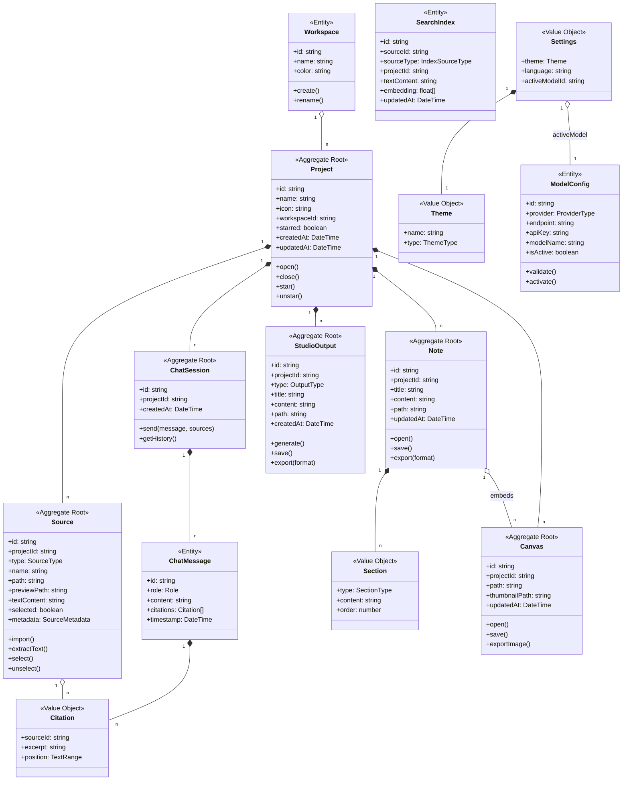
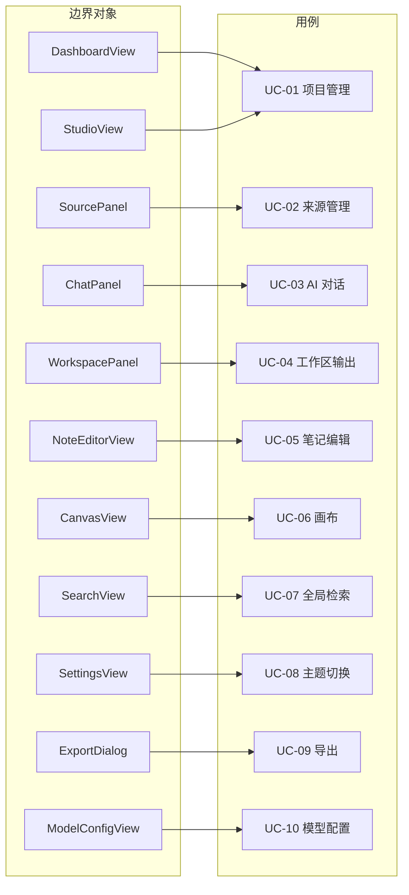
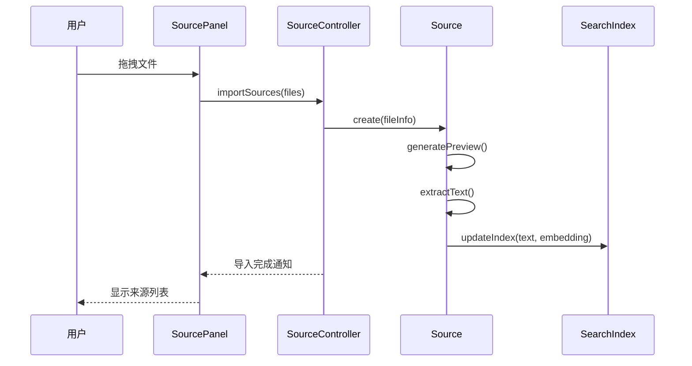
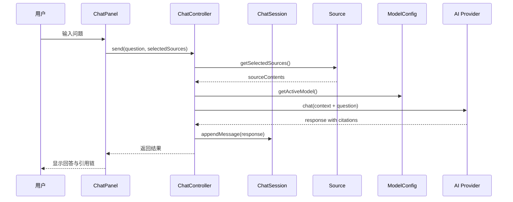
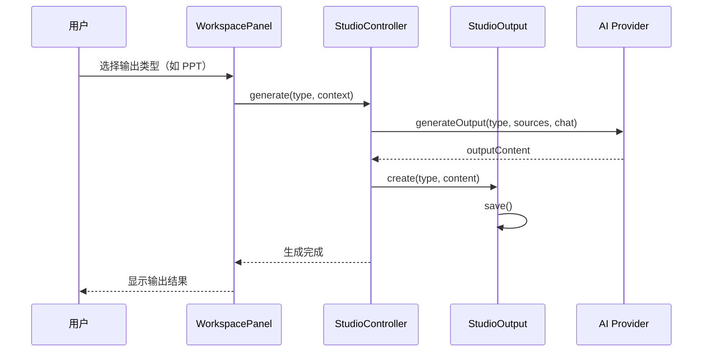
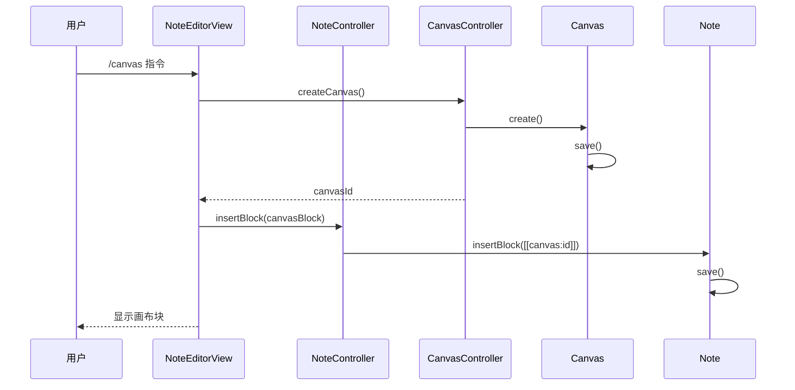
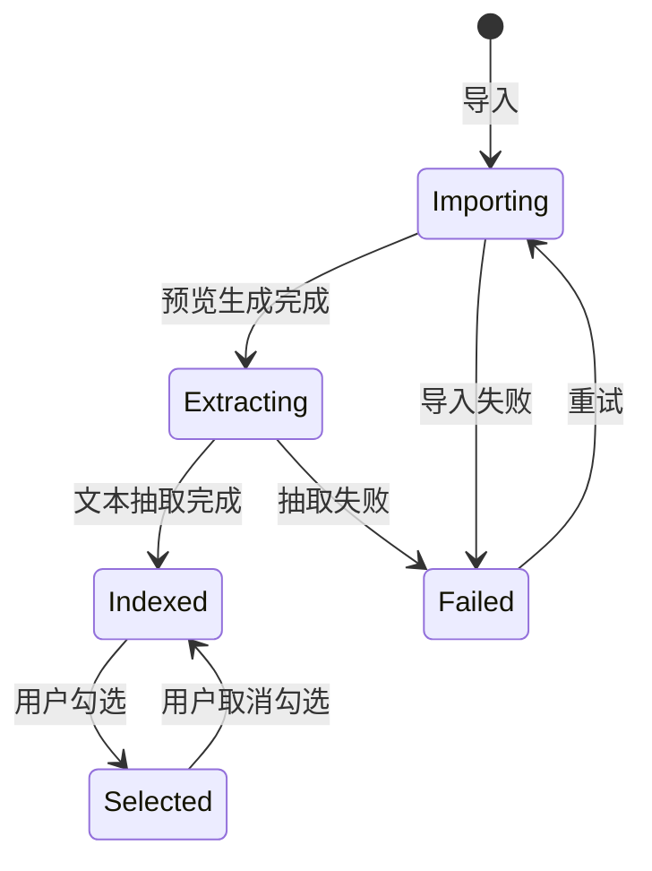
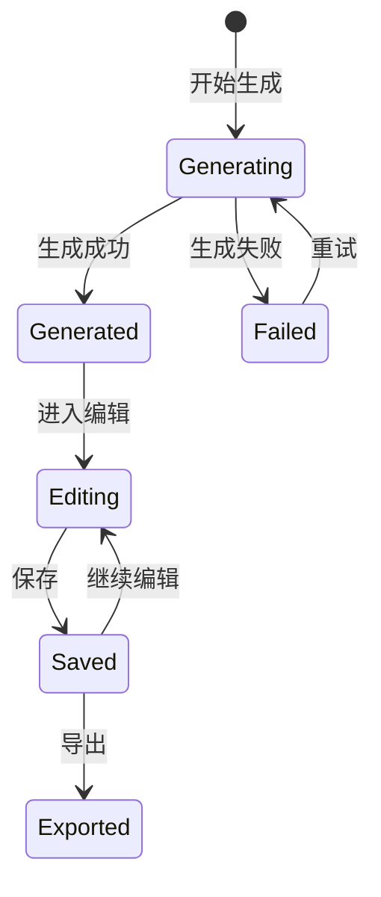
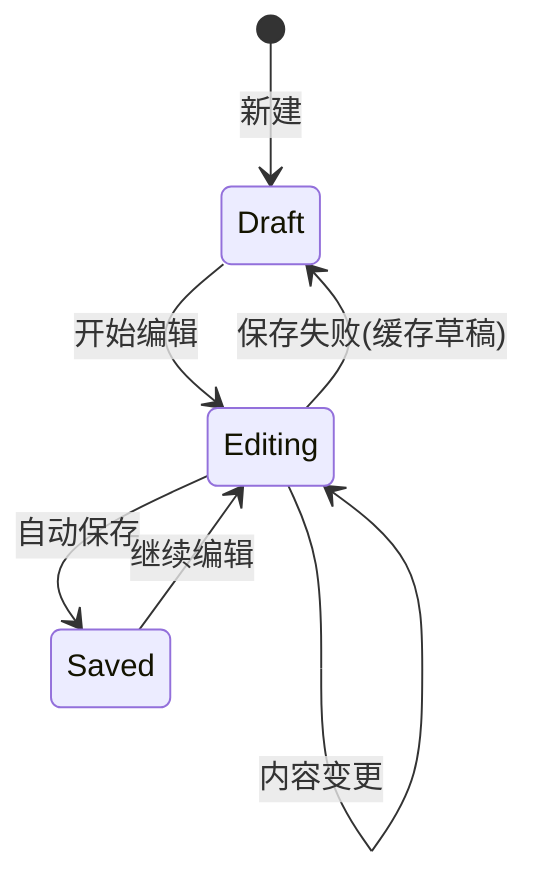

# AI 工作助手：面向对象需求分析（OOA）

## 1. 分析范围

本分析聚焦桌面端 AI 工作助手的核心能力：**项目/笔记本管理**、**来源导入与管理**、**AI 对话（基于来源）**、**工作区输出**（笔记/摘要/PPT/报告/思维导图/画布）、搜索索引、浅色/深色主题与可扩展架构。

## 2. 参与者（Actors）

| 参与者 | 职责 |
|--------|------|
| 用户（个人） | 创建/管理项目、导入来源、发起 AI 对话、生成输出 |
| AI 模型（本地/云端） | 基于来源回答问题、生成摘要/报告/PPT 等 |
| 文件系统 | 存储项目、来源、笔记、输出与缓存 |
| 索引服务 | 维护全文与向量索引 |

## 3. 用例概览（Use Cases）

| 编号 | 用例名称 | 关联需求 |
|------|----------|----------|
| UC-01 | 创建与管理项目 | REQ-F-001~008 |
| UC-02 | 导入与管理来源 | REQ-F-009~015 |
| UC-03 | 发起 AI 对话（基于来源） | REQ-F-016~020 |
| UC-04 | 生成工作区输出 | REQ-F-021~028 |
| UC-05 | 编辑笔记 | REQ-F-029~032 |
| UC-06 | 创建与嵌入画布 | REQ-F-033~035 |
| UC-07 | 全局检索 | REQ-F-036~038 |
| UC-08 | 主题切换 | REQ-F-039~041 |
| UC-09 | 导出内容 | REQ-F-042~043 |
| UC-10 | 配置与切换模型提供方 | REQ-F-019~020 |

## 4. 用例详述

### UC-01 创建与管理项目

**前置条件**：应用启动

**主流程**：
1. 用户在首页点击「创建新项目」
2. 输入项目名称并选择工作空间分类
3. 系统创建项目目录并显示项目卡片
4. 用户可对项目进行重命名、删除、星标、排序

**异常流程**：
- A1：项目名称重复 → 提示并要求重新命名

**验收标准**：
- 可创建项目并显示在首页卡片网格
- 项目可按工作空间分类、支持星标和排序
- 全局搜索可找到项目

---

### UC-02 导入与管理来源

**前置条件**：已进入项目工作室

**主流程**：
1. 用户在来源面板拖拽或点击添加来源
2. 系统识别类型并生成预览/缩略图
3. 抽取文本并写入向量索引
4. 来源显示在列表中，可勾选控制 AI 引用范围

**异常流程**：
- A1：不支持格式 → 提示并跳过
- A2：解析失败 → 标记失败并保留原文件

**验收标准**：
- PDF/Word/图片/Markdown 可导入并预览
- 来源可勾选/取消勾选
- 文本抽取完成后可被语义检索命中

---

### UC-03 发起 AI 对话（基于来源）

**前置条件**：已导入来源且已配置模型

**主流程**：
1. 用户在来源面板勾选要引用的来源
2. 在对话区输入问题
3. 系统组装上下文（选中来源内容）并调用模型
4. 返回结果并附带引用链

**异常流程**：
- A1：模型不可用 → 提示并建议切换

**验收标准**：
- AI 对话基于选中来源回答
- 输出可显示引用来源（可点击跳转）
- 本地模型与 API 模型均可切换使用

---

### UC-04 生成工作区输出

**前置条件**：已有 AI 对话或来源内容

**主流程**：
1. 用户在工作区选择输出类型（笔记/摘要/PPT/报告/思维导图/画布）
2. 系统根据来源和对话内容生成输出
3. 输出保存到工作区并可编辑

**异常流程**：
- A1：生成失败 → 提示并保留草稿

**验收标准**：
- 可生成笔记、摘要、PPT、分析报告、思维导图
- 输出可保存并在工作区展示
- 笔记可进入编辑模式

---

### UC-05 编辑笔记

**前置条件**：已有笔记或新建笔记

**主流程**：
1. 用户打开笔记进入编辑界面
2. 所见即所得编辑，触发自动保存
3. 笔记更新至文件系统与索引

**异常流程**：
- A1：保存失败 → 提示并保留本地草稿缓存

**验收标准**：
- 可编辑笔记，关闭后可恢复内容
- 自动保存不影响输入

---

### UC-06 创建与嵌入画布

**前置条件**：画布模块启用

**主流程**：
1. 用户在工作区选择画布或在笔记中插入画布块
2. 系统创建画布文件并生成缩略图
3. 笔记中引用画布并保持同步

**异常流程**：
- A1：画布加载失败 → 提示并提供重试

**验收标准**：
- 画布可创建并正常保存
- 笔记中画布块可正常打开与编辑

---

### UC-07 全局检索

**前置条件**：索引已建立

**主流程**：
1. 用户在首页或顶部搜索栏输入关键字
2. 系统返回项目/来源/笔记结果
3. 用户点击结果打开对应内容

**异常流程**：
- A1：索引失效 → 触发重建并提示用户

**验收标准**：
- 搜索可覆盖项目、来源和笔记
- 语义检索可用
- 过滤条件可准确缩小范围

---

### UC-08 主题切换

**前置条件**：主题系统可用

**主流程**：
1. 用户在设置中选择浅色/深色主题
2. 系统即时应用主题并持久化设置

**异常流程**：
- A1：主题加载失败 → 回退默认主题

**验收标准**：
- 浅色/深色主题可一键切换并在重启后保持
- 面板可折叠与展开

---

### UC-09 导出内容

**前置条件**：当前笔记或 PPT 可访问

**主流程**：
1. 用户选择导出格式（PDF/Word/Markdown/PPT）
2. 系统生成目标文件并保存到指定位置
3. 提示导出成功并可打开位置

**异常流程**：
- A1：导出失败 → 提示并保留原内容

**验收标准**：
- 笔记可导出为 PDF / Word / Markdown
- PPT 可导出为标准格式
- 导出失败不影响原内容

---

### UC-10 配置与切换模型提供方

**前置条件**：模型配置界面可用

**主流程**：
1. 用户选择模型提供方（Claude/Ollama/通义/豆包/DeepSeek/硅基流动）
2. 填写或选择连接配置
3. 保存配置并在 AI 对话中生效

**异常流程**：
- A1：配置无效 → 提示并阻止保存

**验收标准**：
- 可配置并切换模型提供方
- Claude API 为主要底座
- 配置无效时会提示并阻止保存

## 5. 领域对象（Domain Objects）

### 5.1 聚合与实体关系图



### 5.2 核心聚合根（Aggregate Roots）

| 聚合根 | 职责 | 包含实体/值对象 |
|--------|------|-----------------|
| **Project** | 项目管理，知识组织的顶层容器 | Workspace |
| **Source** | 来源管理，AI 对话的知识基础 | SourceMetadata |
| **ChatSession** | AI 会话管理 | ChatMessage, Citation |
| **StudioOutput** | 工作区输出管理（PPT/报告/思维导图等） | - |
| **Note** | 笔记生命周期管理 | Section |
| **Canvas** | 画布生命周期管理 | - |

### 5.3 实体（Entities）

| 实体 | 属性 | 核心操作 |
|------|------|----------|
| **Workspace** | id, name, color | create(), rename() |
| **ChatMessage** | id, role, content, citations, timestamp | - |
| **ModelConfig** | id, provider, endpoint, apiKey, modelName, isActive | validate(), activate() |
| **SearchIndex** | id, sourceId, sourceType, projectId, textContent, embedding | - |

### 5.4 值对象（Value Objects）

| 值对象 | 属性 | 说明 |
|--------|------|------|
| **Citation** | sourceId, excerpt, position | 引用来源 |
| **Section** | type, content, order | 笔记块（标题/列表/代码块等） |
| **Settings** | theme, language, activeModelId | 用户设置 |
| **Theme** | name, type | 主题配置 |
| **TextRange** | start, end | 文本范围 |
| **SourceMetadata** | size, mimeType, createdAt | 来源元数据 |

### 5.5 枚举类型

```typescript
enum SourceType { PDF, DOCX, JPG, PNG, Markdown }
enum OutputType { Note, Summary, PPT, Report, Mindmap, Canvas }
enum ProviderType { Claude, Ollama, Tongyi, Doubao, DeepSeek, SiliconFlow }
enum ThemeType { Light, Dark }
enum SectionType { Heading, Paragraph, List, CodeBlock, Table, TaskList, Canvas }
enum IndexSourceType { Source, Note, Canvas }
enum Role { User, Assistant, System }
```

## 6. 边界对象（Boundary Objects）

### 6.1 视图组件

| 边界对象 | 职责 |
|----------|------|
| **DashboardView** | 首页，项目卡片网格、工作空间导航 |
| **StudioView** | 项目工作室，三栏布局容器 |
| **SourcePanel** | 来源面板，来源导入与列表管理 |
| **ChatPanel** | 对话面板，AI 对话界面 |
| **WorkspacePanel** | 工作区面板，输出工具与已保存内容 |
| **NoteEditorView** | 笔记编辑视图 |
| **CanvasView** | 画布编辑视图 |
| **SearchView** | 全局搜索面板 |
| **SettingsView** | 设置界面 |
| **ModelConfigView** | 模型配置界面 |
| **ExportDialog** | 导出对话框 |
| **ThemeSwitcher** | 主题切换器 |

### 6.2 视图与用例映射



## 7. 控制对象（Control Objects）

| 控制器 | 职责 | 关联用例 |
|--------|------|----------|
| **ProjectController** | 项目创建/删除/分类/星标 | UC-01 |
| **SourceController** | 来源导入/预览生成/文本抽取/选择 | UC-02 |
| **ChatController** | AI 会话管理、上下文组装、引用链处理 | UC-03 |
| **StudioController** | 工作区输出生成（笔记/摘要/PPT/报告/思维导图） | UC-04 |
| **NoteController** | 笔记加载/保存/版本管理 | UC-05 |
| **CanvasController** | 画布生命周期管理 | UC-06 |
| **SearchController** | 索引管理与检索编排 | UC-07 |
| **ThemeController** | 主题切换与持久化 | UC-08 |
| **ExportController** | 导出流程控制 | UC-09 |
| **ModelConfigController** | 模型配置验证与切换 | UC-10 |

## 8. 对象交互序列

### 8.1 UC-02：导入来源并索引



### 8.2 UC-03：AI 对话（基于来源）



### 8.3 UC-04：生成工作区输出



### 8.4 UC-06：画布嵌入笔记



## 9. 状态机

### 9.1 Source 状态



### 9.2 StudioOutput 状态



### 9.3 Note 状态



## 10. 异常处理规范

### 10.1 处理原则

1. **保证核心编辑不中断**：优先保留用户内容
2. **可恢复性优先**：失败要保留草稿与状态
3. **对用户可解释**：给出明确提示与可执行操作

### 10.2 关键异常场景

| 场景 | 处理策略 |
|------|----------|
| 笔记保存失败 | 提示并缓存到本地草稿区 |
| 来源解析失败 | 标记失败并保留原文件 |
| 索引损坏 | 触发重建并提示用户 |
| 模型不可用 | 提示并引导切换本地/云端模型 |
| 画布加载失败 | 允许重试或降级为预览图 |
| 导出失败 | 提示并保留原内容 |
| 输出生成失败 | 提示并保留草稿 |

### 10.3 日志规范

| 级别 | 场景 |
|------|------|
| INFO | 导入/解析/索引的关键事件 |
| WARN | 非致命错误（如来源跳过） |
| ERROR | 功能失败（如保存失败、模型调用失败） |
| DEBUG | AI 调用的模型类型、耗时、Token 消耗 |

## 11. 约束条件

- 仅面向个人用户，无协作对象
- 所有组件需开源协议可商用（MIT/Apache/BSD）
- 插件扩展统一通过 Controller 与 View 边界对接
- 数据本地存储，隐私优先
